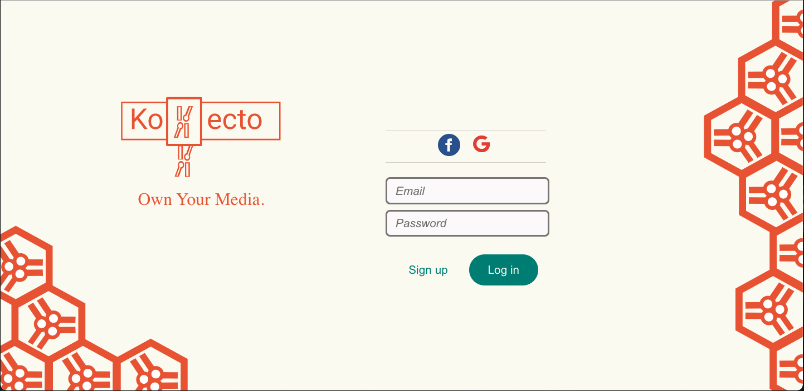
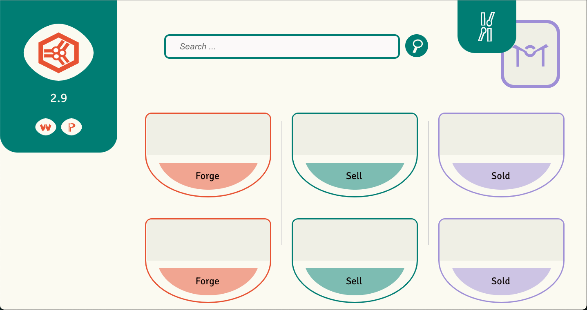
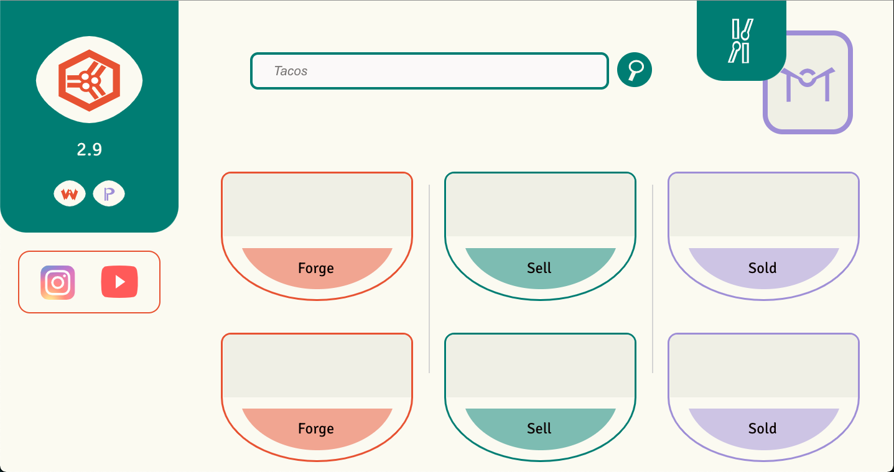
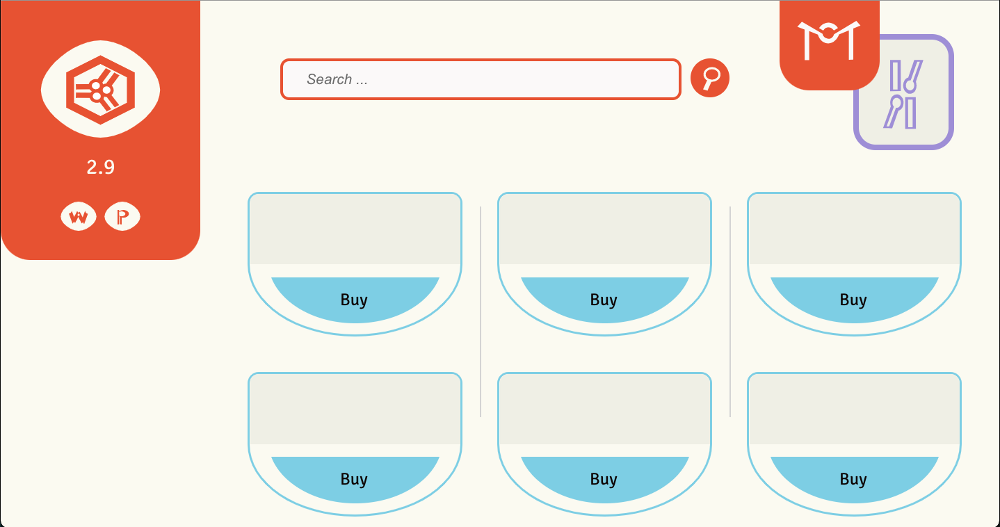
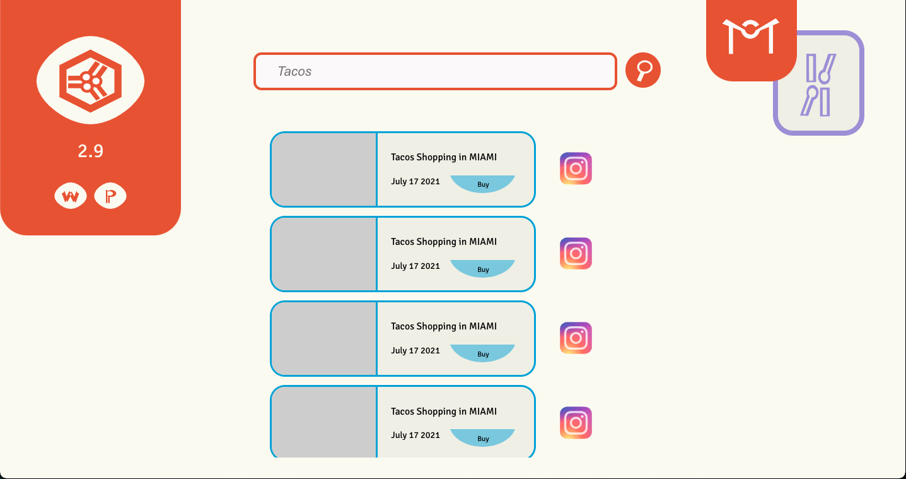
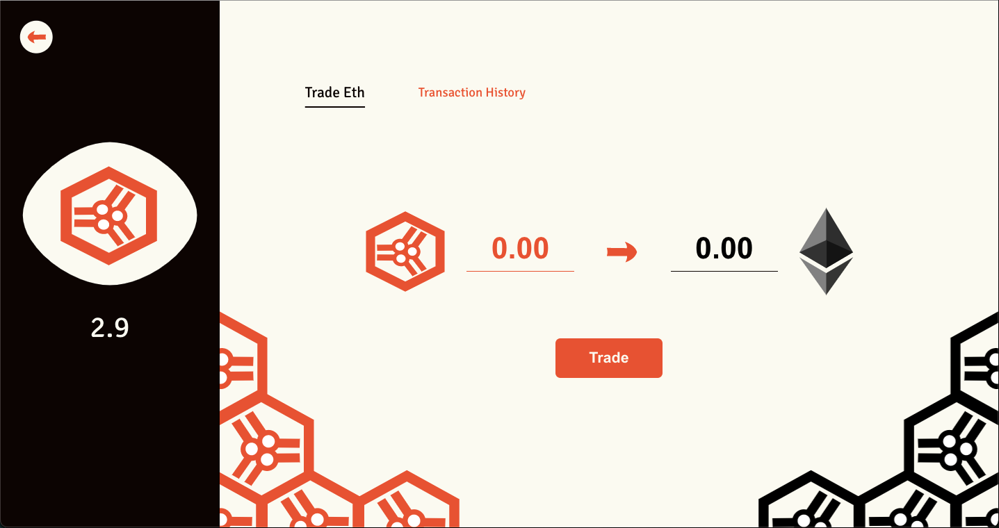
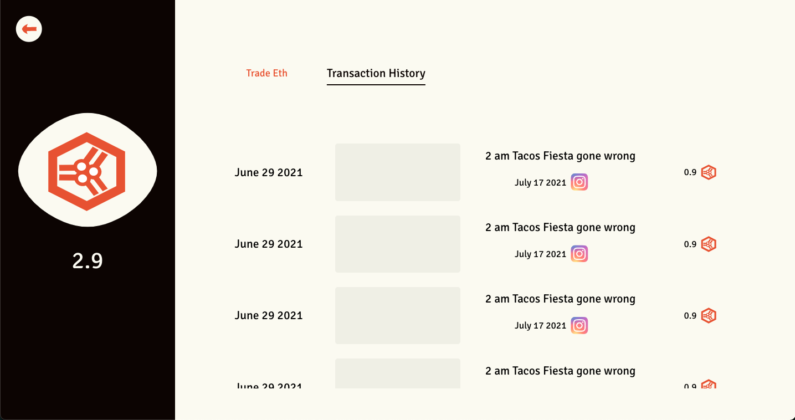

<h1 align='center'>Kollecto Web Application</h1>
<h3 align='center'>Turning Social Media Content into NFTs via the Ethereum blockchain</h3>

## Update Winter 2022 

My Software Engineering degree at McGill requires me to take <a href='https://www.mcgill.ca/study/2021-2022/courses/ecse-428'>ECSE 428</a>. As part of this class, we are required to build a project in groups of 10 developpers. Under the NF-Tea name, the project my team and I undertake is an adaptation of Kollecto, so I choose not to pursue Kollecto anymore. The repository in which my team & I collaborate for the NF-Tea project is available <a href='https://github.com/NFTEA-Winter2022/NF-TEA'>here</a>.

NF-Tea is a web marketplace for NFT minting and trading. Users are invited to connect their Instagram accounts to mint NFTs based on the content that they have posted. The project uses a Vue frontend, a SpringBoot Backend (to handle user-specific suggestions in the marketplace) and Solidity smart contracts (for NFT creation, storage and transactions). This project will be complete (and hopefully its repository made public) in April 2022.

Thus, the current repository for Kollecto is deprecated and is unlikely to be worked upon in the future. It does, however, serve as a PoC for NF-Tea and is a demo of my frontend design and React.js current skills.

## Outline [Deprecated]

As far as our understanding of <a href='https://ethereum.org/en/nft/'>NFTs</a> goes, Non-Fungible Tokens are unique JSON files that can be used to describe digital assets. Really, we're talking about any type of content, as the DogeCoin meme NFT was <a href='https://www.nbcnews.com/pop-culture/pop-culture-news/iconic-doge-meme-nft-breaks-records-selling-roughly-4-million-n1270161'>reportedly</a> traded for 4 million USD in June 2021.

NFTs are a collector's game, as they essentially archive the internet. Once put up on the <a href='https://ipfs.io'>IPFS network</a>, they become timeless.
What's more, the ease of reproduction of the assets they represent is not a bother to the market. In other words, the right of ownership outlined by an NFT over an asset is not destituted by the asset's digital nature. 

Assets to be minted into NFTs are abundent in social media. As individual Instragram posts & Youtube videos garner millions of likes and views, there is no doubt that social media content is memorable, valuable and thus, NFT worthy. 

One could sell its post as it does with an autograph. One other could auction an event's video to once more interact with its fanbase without the need to create additional content. 

Kollecto is a marketplace that allows NFT minting (creating) & trading based on social media content. It's intial scope targets Instagram & Youtube. The project bases itself on the Ethereum blockchain's smart contracts functionality and puts forward its own cryptocurrency: Koyn. 

## Project Structure [Deprecated]
The project is contained within two repostories

* Kollecto-Web -> Current Repository
* NF-Tea -> Private to the McGill ECSE 428 class for now :(

## Technologies in play [Deprecated]
| Frontend:  | Backend: | Cryptocurrency Logic: | External APIs: |
| ------------- | ------------- | ------------- | ------------- |
|  React JS  | Spring Boot | Ethereum blockchain | Youtube Data V3
  Javascript | PostgreSQL | Ganache | Instagram Basic Display
  HTML | Heroku | Truffle |
  CSS|   | Solidity |
  Figma | | Web3 |

## Progress [Deprecated]

### Frontend
The design has been conceived in Figma & has been coded using React JS. Snippets of the functional views of the web application can be found in the following section. UI views are currently static & are awaiting development of the Kollecto-API project to be brought to life. 

### External API Integration
The UI is currently capable to use the Youtube Data V3 API to log in an user & fetch metadata about its uploaded videos.

## Currently implemented user interface [Deprecated]

| Login Page | 
| ------------- |
|   | 
 
| User Inventory | 
| ------------- |
|   | 

| Inventory & Platform Picker Open View | 
| ------------- |
|   | 

| Market | 
| ------------- |
|   | 

| Search Tool Open View | 
| ------------- |
|   | 
 
| Ethereum Trading View | 
| ------------- |
|   | 

| User Transaction History | 
| ------------- |
|   | 

